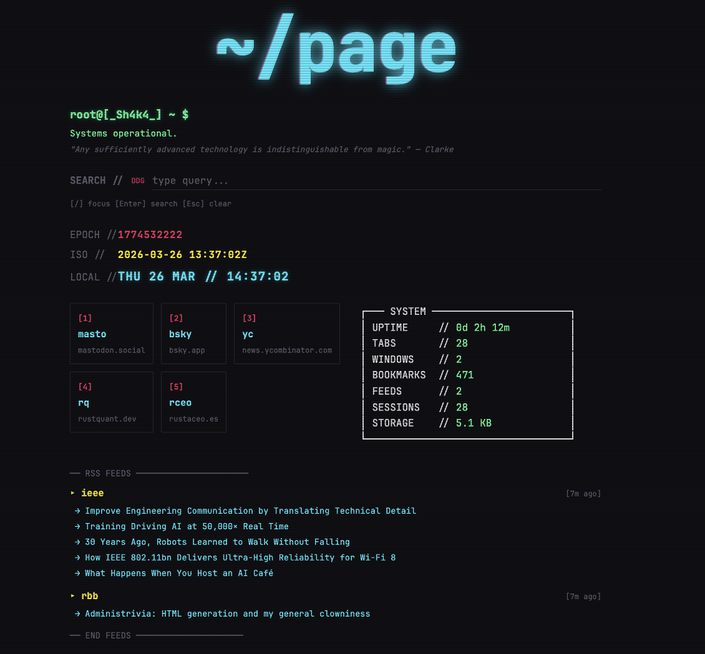

# ~/page



A cyberpunk neon command center for your Firefox new tab.

> ⚠️ **This project was written entirely by AI** (Claude via [OpenCode](https://opencode.ai)). The human author directed the design and features; all code was generated and iterated through AI assistance.

## Features

- **Clock** — Unix epoch, ISO 8601, and local time displayed simultaneously
- **Search** — DuckDuckGo, Google, Brave, Bing, or Kagi (configurable)
- **Quick links** — Up to 12 numbered links, opened with `1`–`9` and `0`
- **System stats** — Neofetch-style browser stats (tabs, bookmarks, uptime, storage)
- **RSS reader** — Polled by the background service worker via `browser.alarms`
- **Settings** — Full configuration page for all of the above
- **Export / Import** — JSON backup and restore
- **Onboarding** — First-run setup flow

## Keyboard shortcuts

| Key | Action |
|-----|--------|
| `/` | Focus search bar |
| `1`–`9`, `0` | Open quick link |
| `,` | Open settings |
| `Esc` | Back to ~/page (from settings) / blur input |
| `r` | Refresh RSS feeds |
| `e` | Export data as JSON |
| `?` | Toggle shortcuts help |

## Install (development)

```bash
npm install
npm start        # opens Firefox with the extension loaded
npm run build    # produces web-ext-artifacts/homepage-x.x.x.zip
npm run lint     # validate the extension
```

Requires [Firefox](https://www.mozilla.org/firefox/) and Node.js.

To load manually: open `about:debugging#/runtime/this-firefox` → **Load Temporary Add-on…** → select `manifest.json`.

## Tech

- Vanilla HTML / CSS / JS — zero frameworks, zero build step
- Firefox Manifest V3
- `browser.storage.local` for all persistence
- `browser.alarms` for background RSS polling
- Fonts bundled locally: [VT323](https://fonts.google.com/specimen/VT323) + [JetBrains Mono](https://www.jetbrains.com/lp/mono/)

## License

MIT — see [LICENSE](LICENSE).
